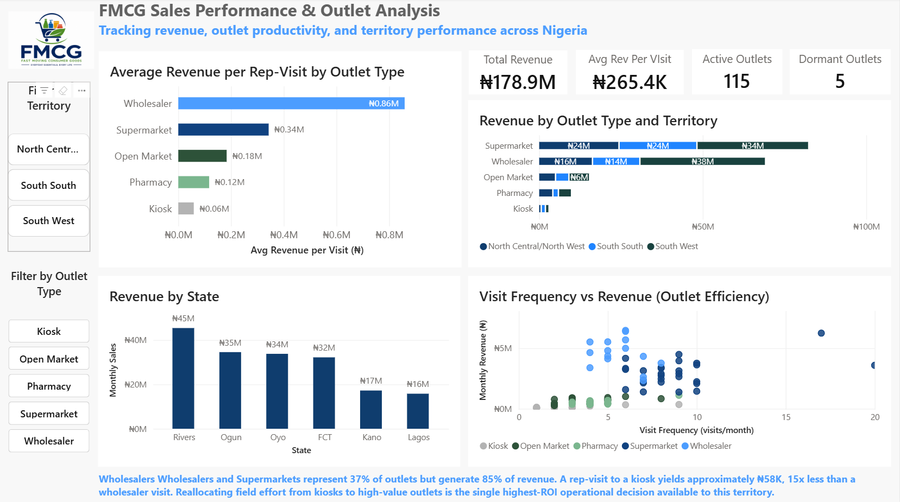

# Nigeria FMCG Outlet Distribution Intelligence

**Tools:** SQL (SQLite · DB Browser) · Power BI · Excel
**Domain:** FMCG Field Force Optimisation · Trade Channel Analytics
**Data:** Synthetic dataset designed from first-hand FMCG 
commercial experience

---

## Context

Outlet-level Nigerian FMCG field force data, covering visit 
economics, OOS patterns, and territory revenue structures, is 
not available in any public repository. Proprietary sources like 
NielsenIQ and Kantar publish aggregated market data, but not the 
outlet-level operational detail that drives field force decisions.
This project fills that gap with a synthetic dataset built from 
first-hand commercial experience.

The dataset was designed from four years of Key Account Management 
experience at Henkel AG Nigeria (Fortune Global 500 · Düsseldorf, 
Germany) - managing home care and cleaning product lines across 
Modern Trade, Traditional Trade, and Wholesale channels. Every 
column, every value range, and every business rule reflects how 
Nigerian FMCG trade operations actually work. The numbers are 
synthetic. The commercial logic is not.

---

## Business Problem

A Nigerian FMCG territory with 120+ retail outlets allocates 
field rep visits by geography and relationship, not by revenue 
efficiency. The result: reps spend the same time on 
₦50,000/month kiosks and ₦800,000/month wholesalers.

This analysis quantifies that inefficiency and identifies 
exactly where reallocation drives the highest incremental 
revenue.

**Five commercial questions answered:**

1. Which channel types drive the most revenue?
2. Which outlet type and territory generates the highest 
   revenue per rep-visit?
3. How much revenue is locked in dormant outlets, and 
   which territories hold it?
4. Which outlets should be on every rep's non-negotiable 
   visit list?
5. Which high-revenue outlets are most exposed to 
   stockout risk?

---

## Dataset

**File:** `Nigeria_Outlet_Universe_2024.xlsx`
**Rows:** 120 outlets across 6 Nigerian states
**Type:** Synthetic — designed from first-hand trade 
channel experience

| Column | Description |
|---|---|
| `outlet_id` | Unique outlet identifier |
| `outlet_name` | Retail outlet name |
| `outlet_type` | Supermarket / Open Market Stall / Kiosk / Wholesaler / Pharmacy |
| `state` | Lagos · Ogun · Oyo · Rivers · Kano · FCT |
| `lga` | Local Government Area |
| `monthly_sales_NGN` | Average monthly revenue (Naira) |
| `visit_freq_per_month` | Number of rep visits per month |
| `sku_count` | Number of SKUs stocked |
| `oos_incidents_per_month` | Out-of-stock events per month |
| `competitor_share_pct` | Estimated competitor shelf share (%) |
| `outlet_active` | 1 = Active · 0 = Dormant |
| `sales_rep_id` | Assigned field representative |
| `territory` | Sales territory grouping |

---

## SQL Queries

**File:** `outlet_analysis.sql`

| # | Business Question | Technique |
|---|---|---|
| Q1 | Revenue concentration by channel type | GROUP BY · subquery |
| Q2 | Revenue per rep-visit by outlet type and territory | SUM/SUM aggregation · NULLIF |
| Q3 | Dormant outlet count and recoverable revenue by territory | Filtered aggregation |
| Q4 | Top 20 outlets by monthly sales | ORDER BY · LIMIT |
| Q5 | High OOS + high revenue = priority restocking targets | Multi-condition WHERE |

**Technical note on Q2:** Revenue per visit is calculated as
`SUM(revenue) / SUM(visits)` at group level — not as an average
of individual outlet ratios. Averaging individual ratios distorts
the result in favour of low-volume outliers. The SUM/SUM method
correctly represents how much revenue each rep-visit generates
across an outlet type and territory.

---

## How to Run

**Software required:** DB Browser for SQLite — free download 
at sqlitebrowser.org

1. Download `Nigeria_Outlet_Universe_2024.db` from this 
   repository
2. Open DB Browser for SQLite on your computer
3. Click **Open Database** (top left) → select the 
   downloaded `.db` file
4. Click the **Execute SQL** tab at the top
5. Paste any query from `outlet_analysis.sql` into 
   the editor
6. Press **F5** or click the **Run** button

To view the raw data: click the **Browse Data** tab and 
select the Outlets table.

---

## Key Findings

| # | Finding | Detail |
|---|---|---|
| 1 | Wholesalers and supermarkets drive 85% of revenue | 45 outlets (37% of territory) generate ₦151.2M of ₦178.9M total |
| 2 | 15× efficiency gap between wholesalers and kiosks | Wholesalers: ₦858K/visit · Supermarkets: ₦342K/visit · Kiosks: ₦58K/visit |
| 3 | ₦8.4M/month locked in dormant outlets | 5 outlets across South West (₦6.4M) and South South (₦2.0M) |
| 4 | ₦73.6M/month exposed to stockout risk | 23 high-revenue outlets recording 3+ OOS incidents per month |

---

## Recommendations

**1. Increase supermarket visit frequency**

> **Finding:** Supermarkets generate ₦342K revenue per 
> rep-visit - 6× above kiosks - across 30 active outlets, 
> yet visit frequency is not optimised for revenue yield.
>
> **Recommendation:** Add 3 visits/month to each active 
> supermarket outlet.
>
> **Impact:** 30 supermarkets × 3 additional visits × ₦171K 
> (conservative 50% of average visit revenue) = 
> **₦15.4M incremental revenue/month** from existing 
> headcount, no new hires.

**2. Redirect kiosk coverage to wholesale distribution**

> **Finding:** Kiosks generate ₦58K per rep-visit — the 
> lowest of any channel - yet receive direct rep visits at 
> frequencies comparable to wholesalers generating 15× more 
> revenue per call.
>
> **Recommendation:** Route kiosk replenishment through 
> the nearest wholesaler's distribution network, freeing 
> rep time for higher-value outlets.
>
> **Impact:** Approximately 11 freed rep-days/month 
> reallocated to supermarket calls (4 calls/day × ₦342K 
> average) = **₦15M+/month** from the same headcount, 
> zero additional hires.

**3. Reactivate dormant outlets in South West and 
South South**

> **Finding:** 5 dormant outlets across two territories 
> carry a last-recorded combined monthly revenue of 
> ₦8.4M — ₦6.4M in South West (2 outlets) and ₦2.0M 
> in South South (3 outlets).
>
> **Recommendation:** Target these 5 outlets for a 90-day 
> reactivation programme with promotional support and 
> logistics prioritisation. South West outlets represent 
> the higher-value recovery opportunity and should be 
> prioritised first.
>
> **Impact:** ₦8–10M/month recovered within 60–90 days 
> of reactivation, subject to outlet viability assessment.

---

## Dashboard

🔗 [View Live Dashboard](#) *(add Power BI Service link 
after publishing)*

---

## Limitations

- Dataset is synthetic. Outlet names and figures are 
  illustrative, not drawn from any company's proprietary 
  records.
- Monthly sales represent average figures, not 
  transaction-level data.
- OOS incident counts and competitor share percentages 
  are estimated from field observation experience, not 
  point-of-sale systems.
- A production deployment would use distributor sell-out 
  reports, POS data, and field audit systems as inputs.

---

## Author

**Adetunji Adesibikan**
Data Analyst | FMCG Commercial Analytics | Lagos, Nigeria

[LinkedIn](#) · [GitHub Portfolio](#)